# 企业微信智能机器人接入

这篇文档适合：

- 你已经部署好了 OpenClaw
- 你希望把 OpenClaw 接入企业微信
- 你希望先跑通一个官方可验证的国内渠道

这篇文档会完成什么：

- 在企业微信中创建智能机器人
- 获取 `Bot ID` 和 `Secret`
- 将企业微信机器人与 OpenClaw 关联
- 跑通第一条对话
- 了解智能表格 Webhook 和企微 API 的进一步用法

## 前期准备

当前，可用**企业微信智能机器人**接入 OpenClaw。

在将 OpenClaw 接入企业微信之前，请先确认：

1. 客户端已安装企业微信最新版本
2. 已经在本地设备安装 OpenClaw，或者已经在腾讯云轻量应用服务器 Lighthouse 中部署了 OpenClaw

## 第一步：以长连接方式创建智能机器人，获取 Bot ID 和 Secret

> 通过长连接方式创建的智能机器人，支持被动回复多条消息，也支持主动向用户发送消息。

可在客户端的 `工作台 -> 智能机器人 -> 创建机器人` 中，选择 `API 模式` 创建。


选择以“长连接”方式创建，并获取 `Bot ID` 和 `Secret`。

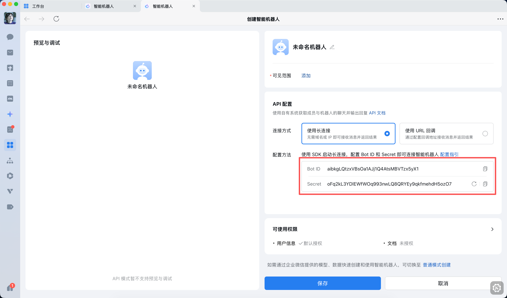

## 第二步：关联企微机器人与 OpenClaw

> 本地部署和云服务商部署的 OpenClaw，都可以使用“终端”完成关联。

### 方式一：在腾讯云 Lighthouse 中部署 OpenClaw 并关联机器人

1. 使用腾讯云轻量应用服务器 Lighthouse。
2. 进入 [轻量云](https://console.cloud.tencent.com/lighthouse)，选中已部署 OpenClaw 的轻量应用服务器，点击服务器实例卡片进入“管理实例”页面，再进入“应用管理”页。

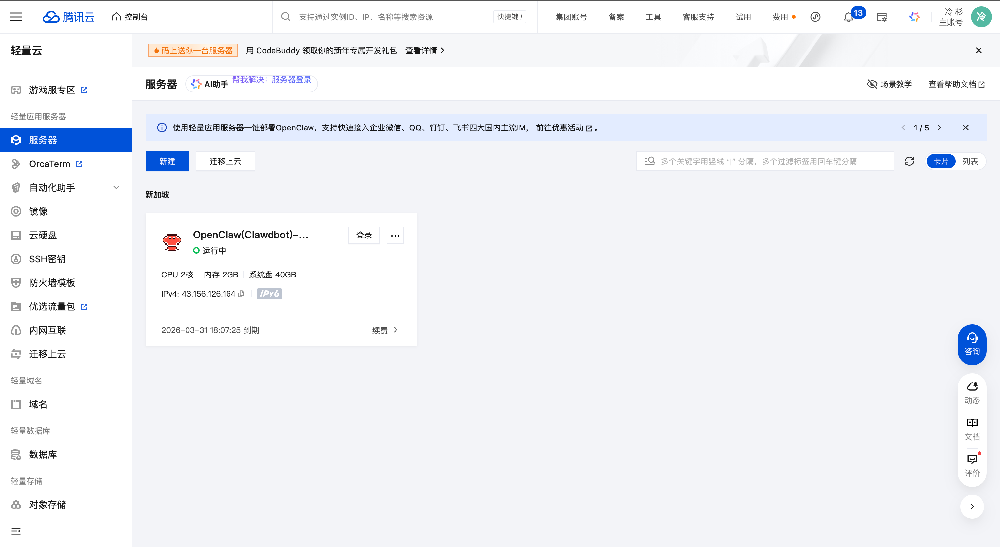

3. 在通道中选择 `企微机器人（长链接）`。
4. 在输入框中填写前一步获取到的 `Bot ID` 和 `Secret`，点击“添加并应用”，并在弹窗中确认。稍等片刻后，就可以看到已经完成的企业微信机器人配置。

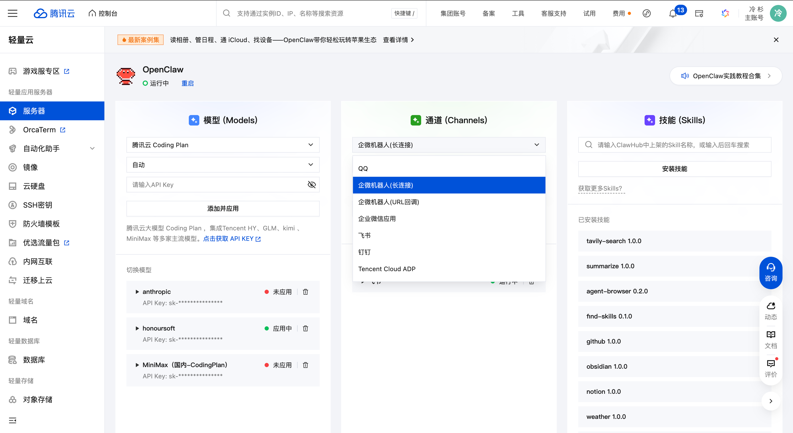

5. 点击“添加并应用”，并完成重启。

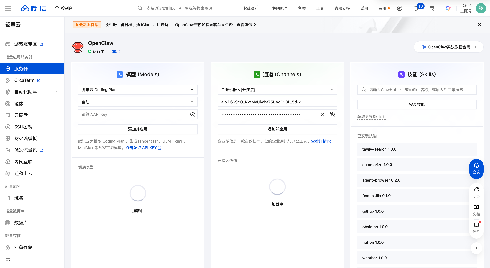

6. 保存机器人，回到企业微信机器人创建页面，保存并创建。
7. 在企业微信中与智能机器人正常对话。

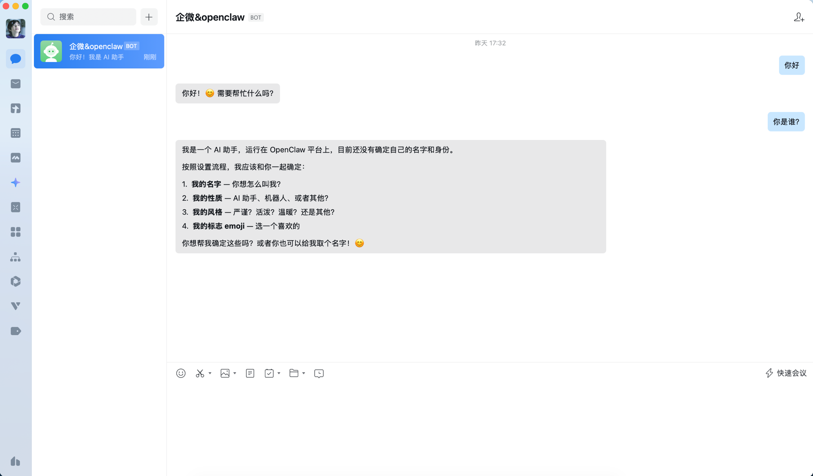

### 方式二：在本地终端部署 OpenClaw 并关联机器人

1. 打开本地终端，安装企微插件：

```bash
openclaw plugins install @wecom/wecom-openclaw-plugin
```

2. 安装成功后，终端会出现类似下面的提示：

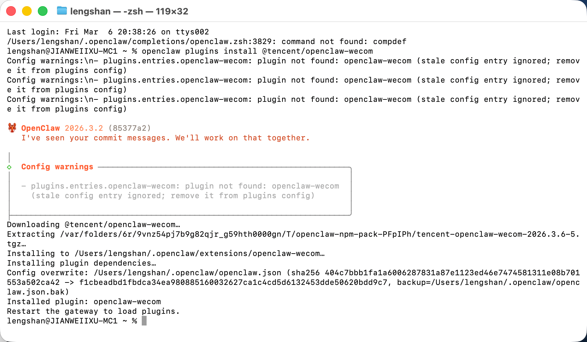

3. 重启 OpenClaw：

```bash
openclaw gateway start
```

4. 添加渠道：

```bash
openclaw channels add
```

5. 在 `select channel` 步骤中，选择渠道为“企业微信”。

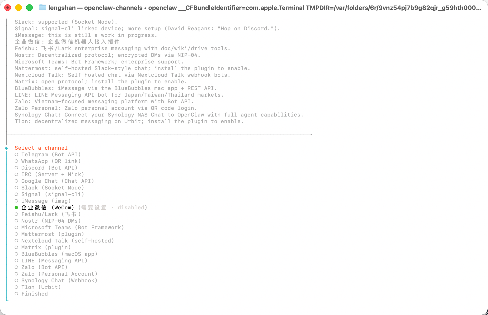

6. 输入企业微信机器人的 `Bot ID` 和 `Secret`。

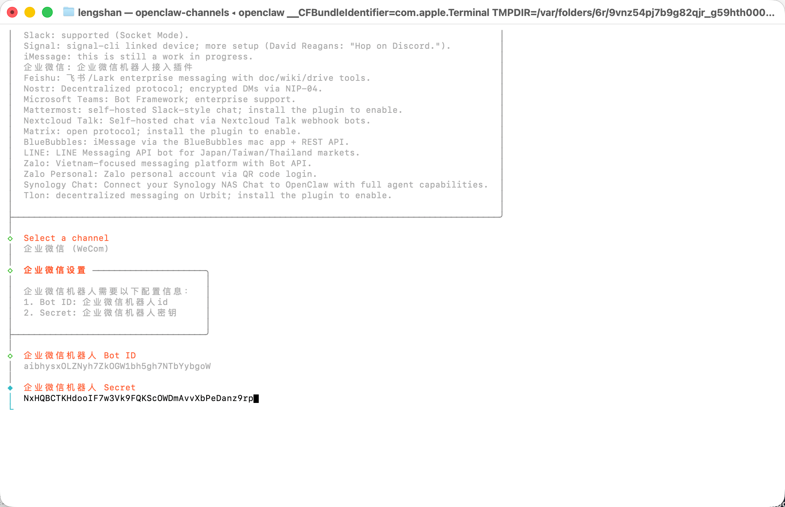

7. 选择 `finish`。

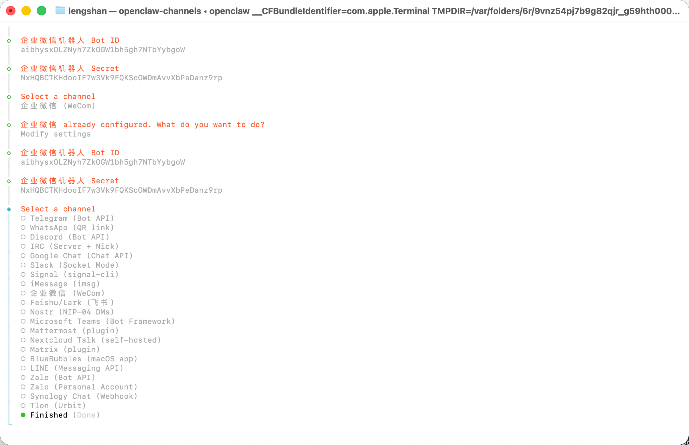

8. 选择配对方式为 `Pairing`。

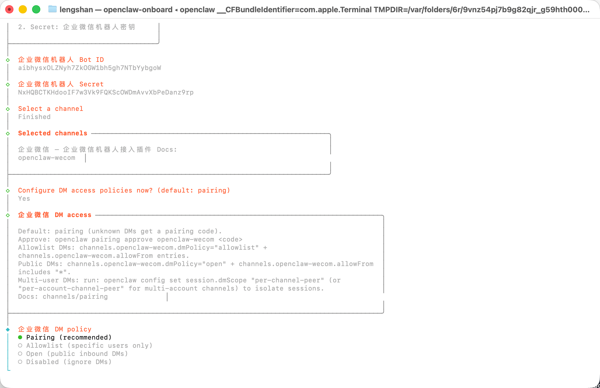

9. 完成后续配置后，可以看到渠道添加成功。

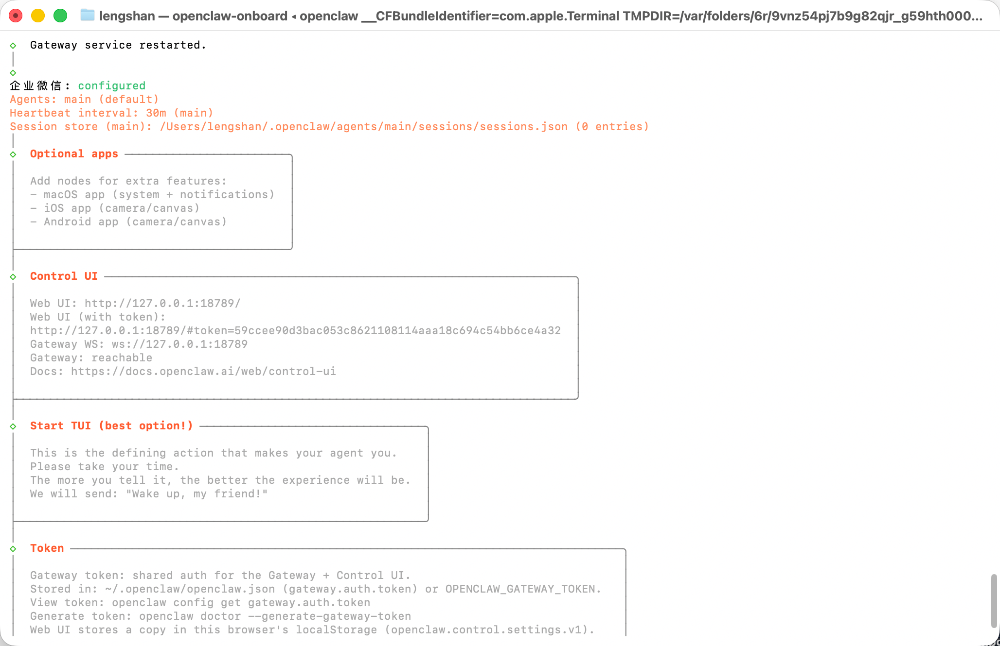

10. 回到企业微信里保存机器人，并给它发送一条消息。此时会收到一条配置密钥消息。

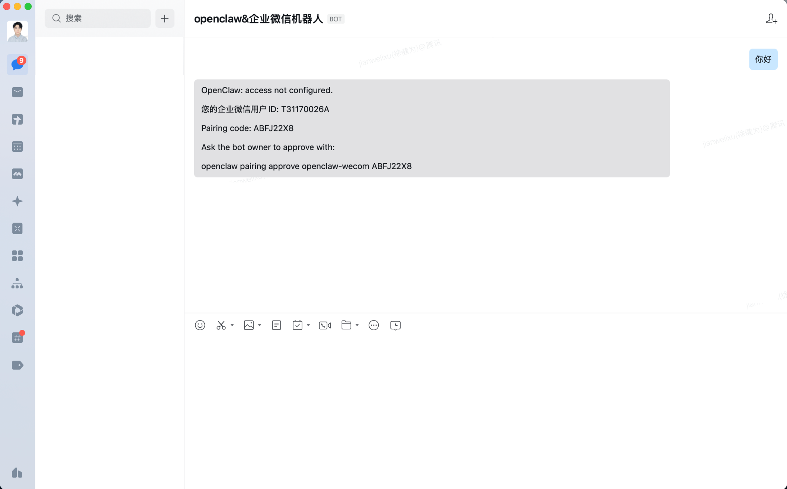

11. 复制这条消息最后一行的密钥，并粘贴回终端，完成配对。

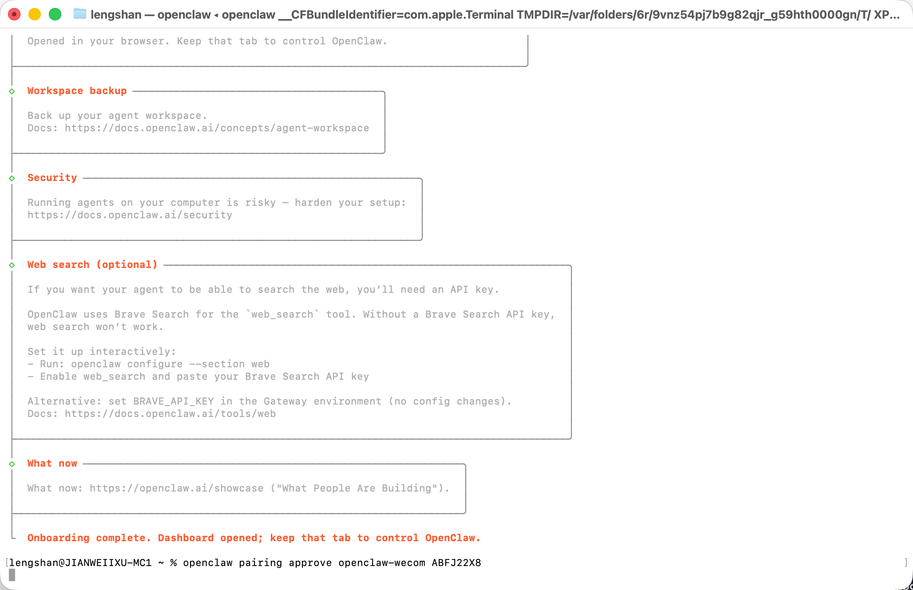

12. 此时就可以在企业微信中正常对话。

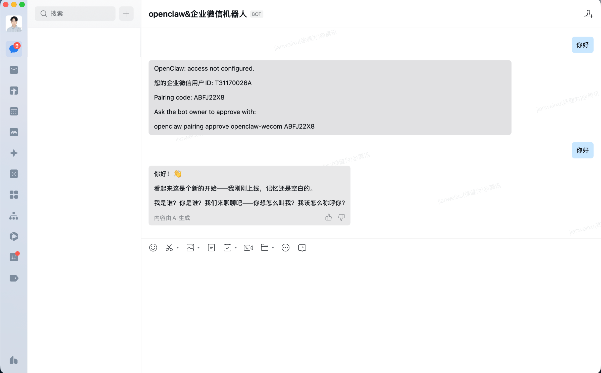

> 如果你使用的是云服务商部署的 OpenClaw，也可以通过 URL 回调方式创建机器人，快速完成对接。

## 附 1：智能表格 Webhook 的使用指引

你可以使用 OpenClaw 快速接入并写入数据到智能表格。配置和接入方法可参考企业微信开发者文档里的 [接收外部数据到智能表格](https://developer.work.weixin.qq.com/document/path/101239)。

当用户在智能表格中开启“接收外部数据”后，系统会为该表格生成唯一的 Webhook 地址。你可以通过标准 HTTP POST 请求新增智能表格记录，或更新已有记录。

适用于以下典型场景：

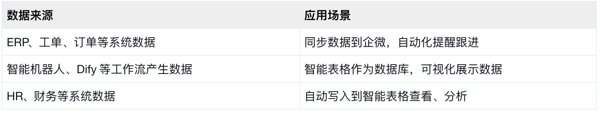

## 附 2：使用企微 API

如果你还想进一步调用企微应用 API，可以继续这样做：

1. 在 `管理后台 -> 我的企业` 获取企业 ID。
2. 在 `应用管理 -> 自建应用` 获取应用 `Secret`。

建议新建一个企业或测试应用来完整体验这一段。

- 获取 `corpid`：

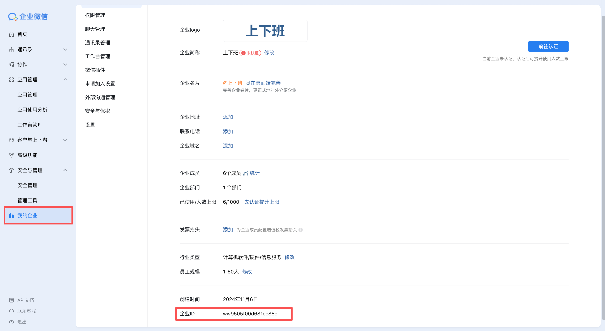

- 获取 `Secret`：进入自建应用，点击查看并发送 Secret 后，即可在消息列表中拿到对应密钥。

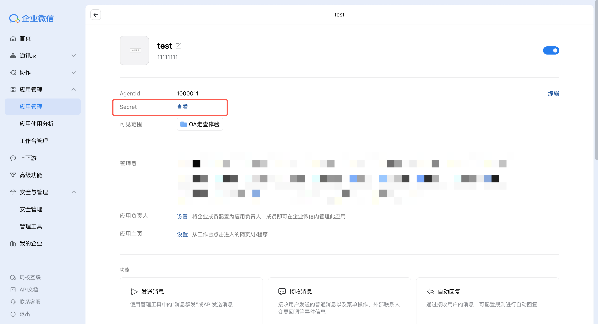

把企业 ID 和应用 Secret 发送给已经关联 OpenClaw 的机器人后，即可发起 [获取 access token 指令](https://developer.work.weixin.qq.com/document/path/91039)，并通过 access token 调用更多企微 API，比如 [调用文档 API](https://developer.work.weixin.qq.com/document/path/97392)。

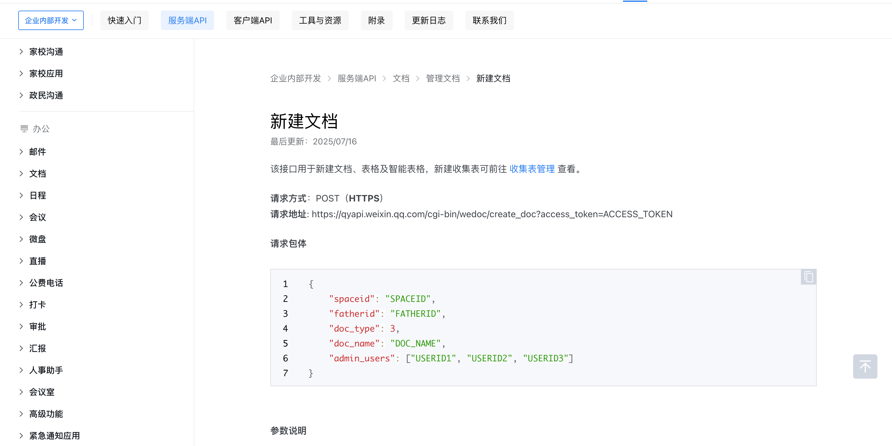

## 常见问题

### 1. 为什么这里强调“长连接”方式

这篇文档对应的是企业微信官方帮助中心里当前可验证的智能机器人接入方案。照着这条主线走，最容易先把 OpenClaw 和企业微信跑通。

### 2. 本地部署和腾讯云 Lighthouse 部署，应该先走哪条

如果你只是先体验企业微信对话，优先走本地部署。

如果你希望机器人长期在线，优先走 Lighthouse 或后续的 Linux VPS 部署方案。

### 3. 配对时收不到密钥怎么办

先检查这几项：

- 企业微信机器人是否已经保存并创建
- OpenClaw 插件是否安装成功
- `openclaw gateway start` 是否已经正常执行
- `openclaw channels add` 里是否正确填写了 `Bot ID` 和 `Secret`

## 来源

- 官方帮助文档：[OpenClaw接入企业微信智能机器人](https://open.work.weixin.qq.com/help2/pc/cat?doc_id=21657&invite_source=19&invite_channel=6&invite_olduser=1&inviter_identity=2&version=5.0.6.70630&platform=mac)
- 截图来源记录见 [assets/channels/wecom/SOURCES.md](../assets/channels/wecom/SOURCES.md)
